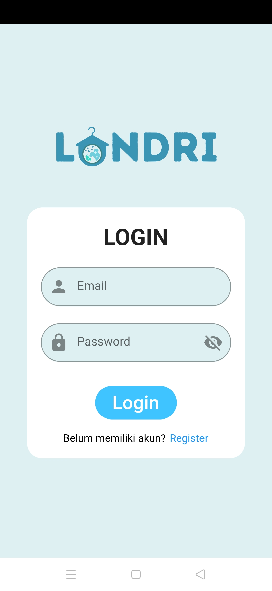
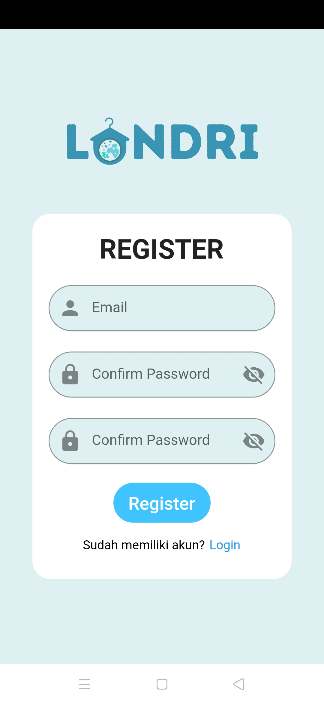
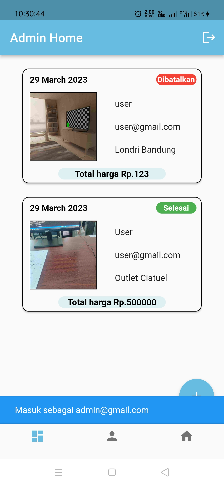
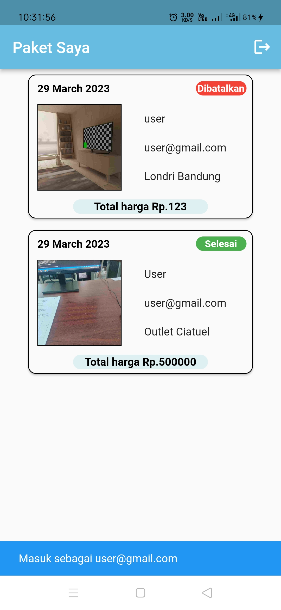
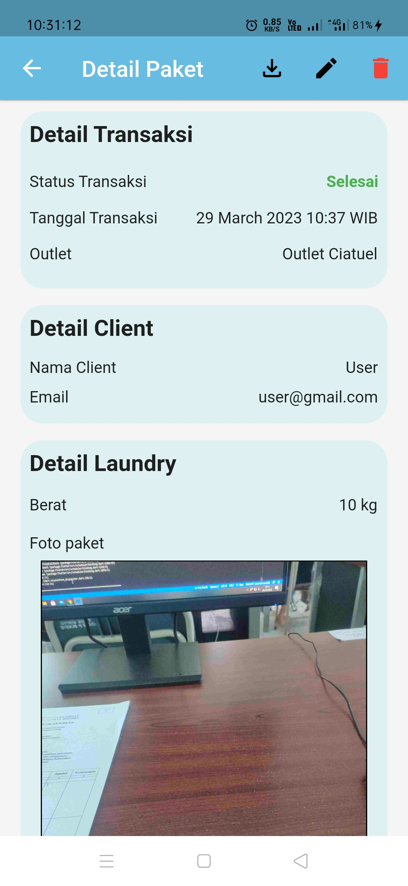
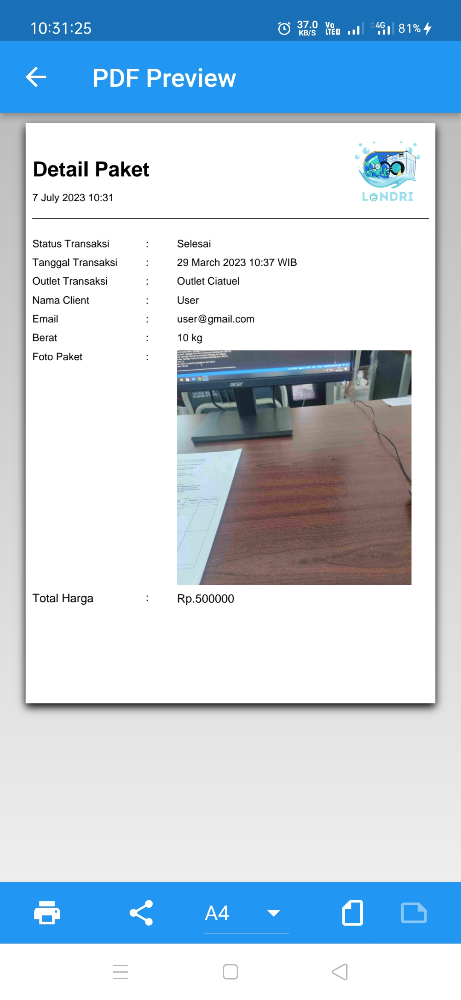
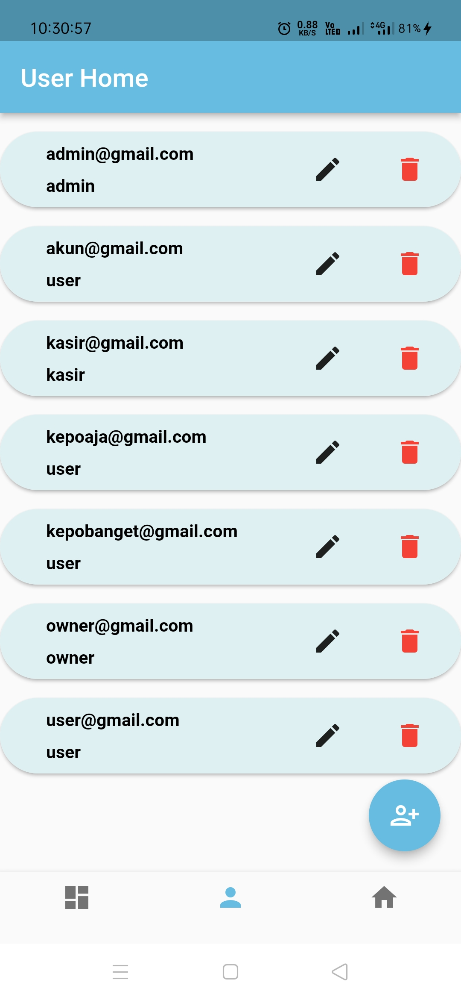
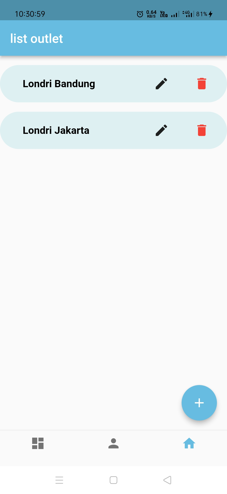

# Londri

## Description
Londri is an app for tracking and recording user`s laundry.

## Feature
- Authentication
- Add a laundry order
- Add user and change role
- Add outlet
- Export detail laundry to pdf

## Screenshot

| Login        | Register    | User        | Admin    |
|--------------|-----------|-------|----|
|  |  |  | |
| Detail        | Pdf    | User        | Outlet    |
|  |  |  | |

## What i use
- Firebase auth, storage, and firestore
- 3rd library from https://pub.dev/
